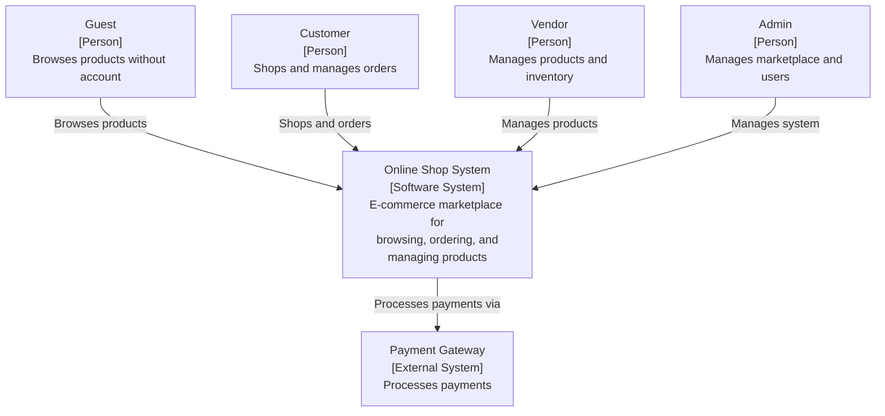
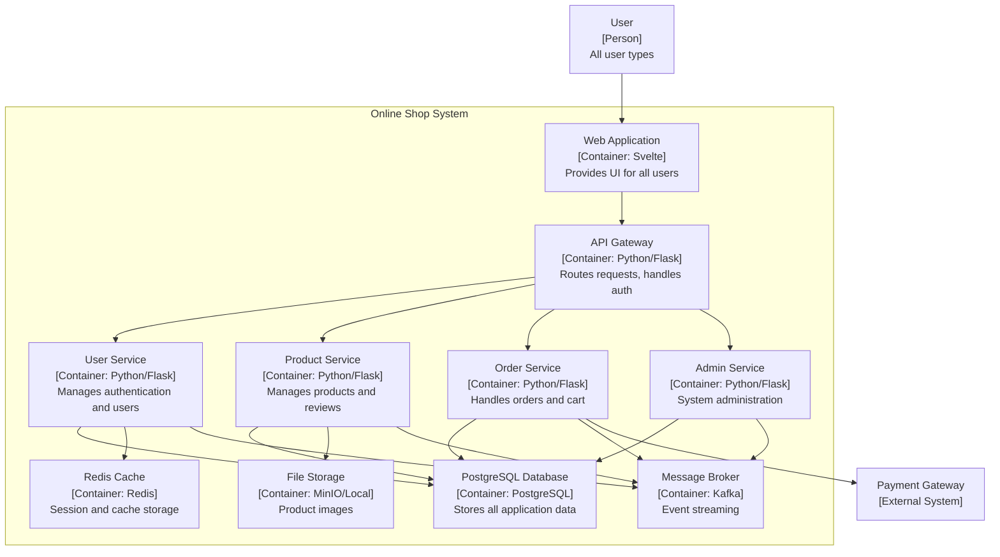
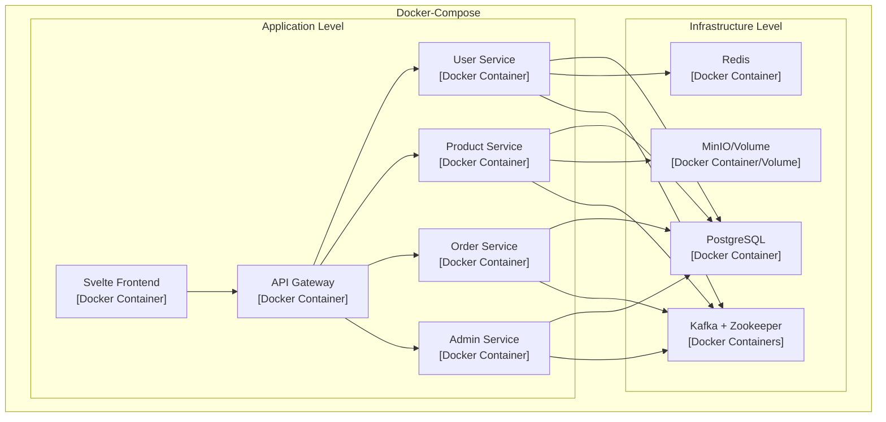

# C4 Architecture Documentation – Online Shop System

### Online Shop System - Context Diagram

This diagram shows the high-level view of the Online Shop System and its interactions with external users and systems.

### Online Shop System - Container Diagram

This diagram shows the high-level containers (applications and data stores) that make up the Online Shop System.

### Online Shop System - Component Diagrams

```mermaid
graph TD
   subgraph "User Service"
       UserCtrl["UserController"]
       UserSvc["UserService"]
       UserRepo["UserRepository"]
       JWT["JWTProvider"]
       UserEntity["User Entity"]
   end
   
   subgraph "Product Service"
       ProductCtrl["ProductController"]
       ProductSvc["ProductService"]
       ProductRepo["ProductRepository"]
       ProductKafka["KafkaProducer"]
       ProductEntity["Product/Category/Review Entity"]
   end
   
   subgraph "Order Service"
       OrderCtrl["OrderController"]
       OrderSvc["OrderService"]
       OrderRepo["OrderRepository"]
       OrderKafka["KafkaProducer"]
       OrderEntity["Order/Cart Entity"]
   end
   
   subgraph "Admin Service"
       AdminCtrl["AdminController"]
       AdminSvc["AdminService"]
       AdminRepo["AdminRepository"]
       AdminKafka["KafkaConsumer"]
       ReportGen["ReportGenerator"]
   end
   
   UserCtrl --> UserSvc
   UserSvc --> UserRepo
   UserSvc --> JWT
   UserRepo --> UserEntity
   
   ProductCtrl --> ProductSvc
   ProductSvc --> ProductRepo
   ProductSvc --> ProductKafka
   ProductRepo --> ProductEntity
   
   OrderCtrl --> OrderSvc
   OrderSvc --> OrderRepo
   OrderSvc --> OrderKafka
   OrderRepo --> OrderEntity
   
   AdminCtrl --> AdminSvc
   AdminSvc --> AdminRepo
   AdminSvc --> AdminKafka
   AdminSvc --> ReportGen
```

### Online Shop System - Deployment Diagram

This diagram shows how the system is deployed using Docker Compose.

# Behaviors – Online Shop System

### Admin Service

### Order Service

### Product Service

### User Service

# ERDs - Online Shop System

### Order Service

### Product Service

### User Service

