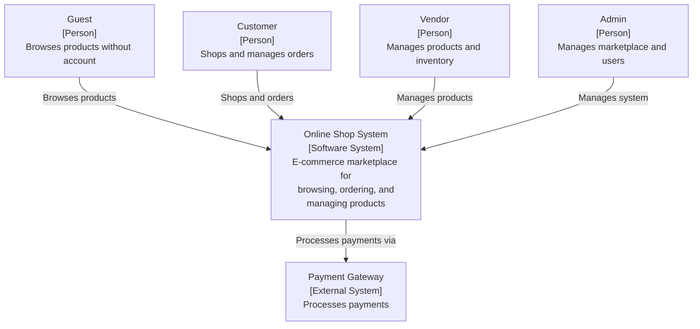

# Online Shop System - C4 Context Diagram

This diagram shows the high-level view of the Online Shop System and its interactions with external users and systems.

```mermaid
graph TB
    %% Define nodes
    Guest["Guest<br/>[Person]<br/>Browses products without account"]
    Customer["Customer<br/>[Person]<br/>Shops and manages orders"]
    Vendor["Vendor<br/>[Person]<br/>Manages products and inventory"]
    Admin["Admin<br/>[Person]<br/>Manages marketplace and users"]
    
    OnlineShop["Online Shop System<br/>[Software System]<br/>E-commerce marketplace for<br/>browsing, ordering, and<br/>managing products"]
    
    PaymentGateway["Payment Gateway<br/>[External System]<br/>Processes payments"]
    
    %% Define relationships
    Guest -->|Browses products| OnlineShop
    Customer -->|Shops and orders| OnlineShop
    Vendor -->|Manages products| OnlineShop
    Admin -->|Manages system| OnlineShop
    
    OnlineShop -->|Processes payments via| PaymentGateway
```
