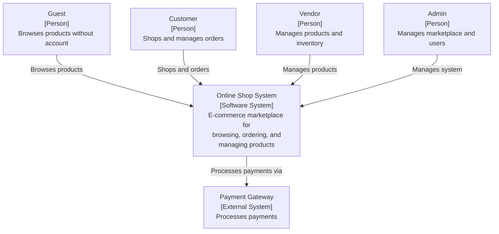
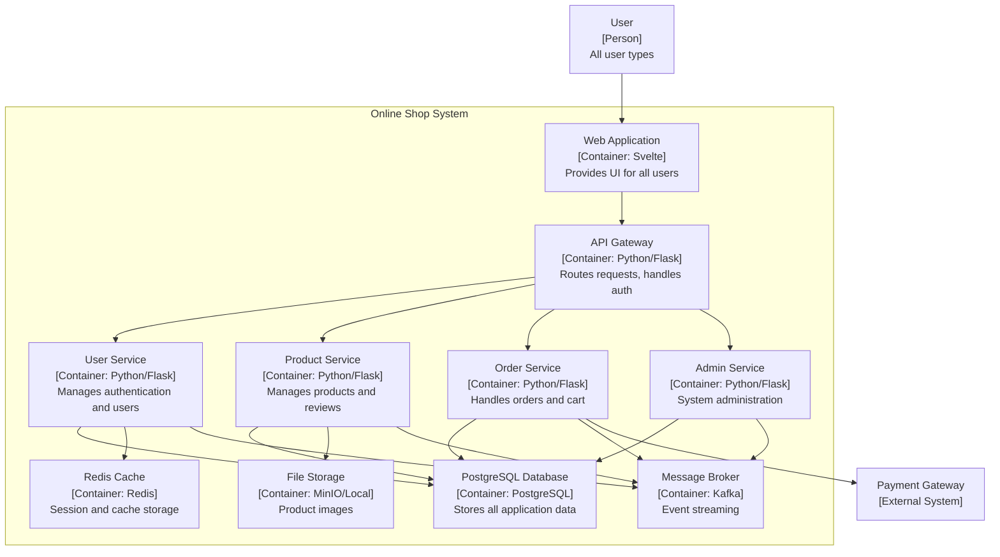

# Online Shop System - C4 Context Diagram

This diagram shows the high-level view of the Online Shop System and its interactions with external users and systems.

# Online Shop System - Container Diagram

This diagram shows the high-level containers (applications and data stores) that make up the Online Shop System.

